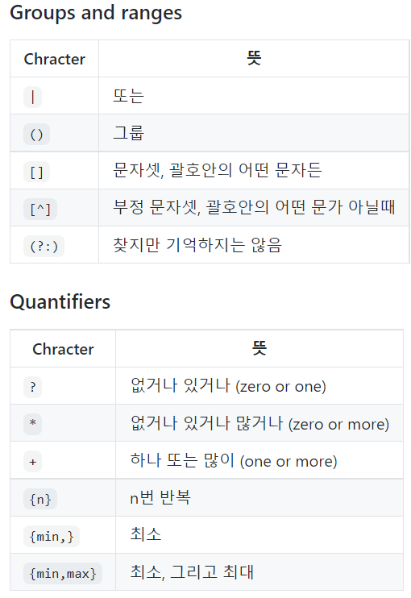
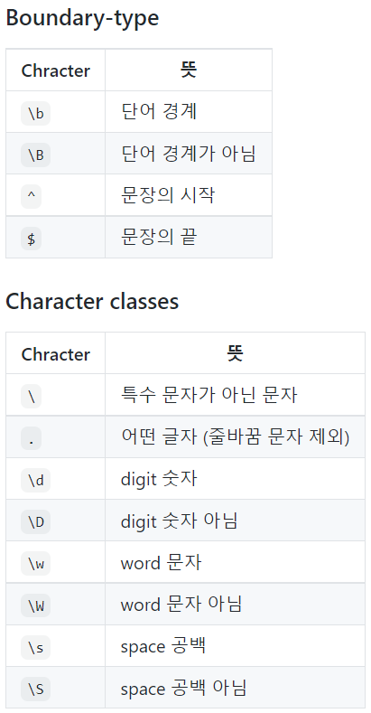

# 2. 알고리즘

## ■ 구현

- 데이터가 100만 개 이하일 때 완전 탐색 사용 적절

## ■ DFS/BFS

- 자료구조 → 데이터를 표현하고 관리/처리하기 위한 구조

    ① stack : 선입후출

    ② queue : 선입선출

- 재귀함수 → 재귀함수는 가장 마지막에 호출한 함수의 수행이 끝나야 그 앞의 함수 호출이 종료됨

## ■ 그래프

1. 인접 행렬 ; 2차원 배열로 그래프의 연결 관계 표현 → O($V^2$)
    - 노드 개수가 많을수록 메모리 불필요하게 낭비됨
    - 두 노드가 연결돼 있는지에 대한 정보 파악 빠름 → O(1)

        [0, 7, 5]
        [7, 0, INF]
        [5, INF, 0]

2. 인접 리스트 ; 리스트로 그래프의 연결 관계 표현 (노드, 간선) → O(E)
    - 연결된 정보만 저장하기 때문에 메모리 효율적
    - 두 노드가 연결돼 있는지에 대한 정보 파악 느림 → O(V)

        [[(1, 7), (2, 5)], [(0, 7)], [(0, 5)]]

## ■ 정렬

### 1. 선택정렬

- 가장 작은 데이터를 선택해 맨 앞에 있는 데이터와 바꾸고, 그다음 작은 데이터를 선택해 앞에서 두 번째 데이터와 바꾸는 과정을 반복 → O($N^2$)
- 코드 [Python]

    ```python
    array = [7, 5, 9, 0, 3, 1, 6, 2, 4, 8]

    for i in range(len(array)):
        min_idx = i
    	    for j in range(i+1, len(array)):
            if array[min_idx] > array[j]:
                min_idx = j
        array[i], array[min_idx] = array[min_idx], array[i]
    ```

- 코드 [JavaScript]

    ```jsx
    let array = [7, 5, 9, 0, 3, 1, 6, 2, 4, 8]

    for (let i = 0; i < array.length-1; i++) {
      let min_idx = i
      for (let j = i+1; j < array.length; j++) {
        if (array[min_idx] > array[j]) {
          min_idx = j
        }
      }
      let tmp = array[i]
      array[i] = array[min_idx]
      array[min_idx] = tmp
    }

    console.log(array)
    ```

### 2. 삽입정렬

- 데이터가 거의 정렬 돼 있을 때 효율적, 좌측은 이미 정렬 돼 있음 → O($N^2$)
- 코드 [Python]

    ```python
    array = [7, 5, 9, 0, 3, 1, 6, 2, 4, 8]

    for i in range(1, len(array)):
        for j in range(i, 0, -1):
            if array[j-1] > array[j]:
                array[j-1], array[j] = array[j], array[j-1]
            else:
                break
    ```

- 코드 [JavaScript]

    ```jsx
    let array = [7, 5, 9, 0, 3, 1, 6, 2, 4, 8]

    for (let i = 1; i < array.length; i++) {
      for (let j = i; i > -1; j--) {
        if (array[j] < array[j-1]) {
          const tmp = array[j-1]
          array[j-1] = array[j]
          array[j] = tmp
        } else {
          break
        }
      }
    }

    console.log(array)
    ```

### 3. 퀵정렬

- 데이터가 거의 정렬 돼 있을 때, O($N^2$)일 수 있음 → O($N*logN$)
- 코드 [Python]

    ```python
    def quick_sort(start, end):
        if start >= end:    # = : 사이드 원소 1개일 때  > 사이드 원소 0개일 때
            return
        pivot = start
        left = start + 1
        right = end

        while left <= right:    # = : 사이드 원소 2개일 때 < : 사이드 원소 3개 이상일 때
            while left<=end and array[left]<=array[pivot]:
                left+=1
            while right>start and array[right]>=array[pivot]:
                right-=1
            if left < right:
                array[left], array[right] = array[right], array[left]
            else:
                array[pivot], array[right] = array[right], array[pivot]

        quick_sort(right+1, end)
        quick_sort(start, right-1)
    ```

- 코드 [JavaScript]

    ```jsx
    let array = [7, 5, 9, 0, 3, 1, 6, 2, 4, 8]

    qucik_sort(0, array.length-1)

    console.log(array)

    function qucik_sort(start, end) {
      if (start >= end) {
        return
      }
      
      let left = start + 1
      let right = end
      let pivot = start

      while (left <= right) {
        while (left <= end && array[pivot] >= array[left]) {
          left++;
        }
        while (right > start && array[pivot] <= array[right]) {
          right--;
        }
        if (left < right) {
          const tmp = array[left]
          array[left] = array[right]
          array[right] = tmp
        }
        else {
          const tmp = array[pivot]
          array[pivot] = array[right]
          array[right] = tmp
        }
      }
      qucik_sort(start, right-1)
      qucik_sort(right+1, end)
    }
    ```

- 코드 개선 [Python]

    ```python
    def quick_sort(array):
        if len(array) <= 1:
            return array
        pivot = array[0]
        tail = array[1:]

        left_side = [x for x in tail if x < pivot]
        right_side = [x for x in tail if x >= pivot]

        return quick_sort(left_side) + [pivot] + quick_sort(right_side)
    ```

### 4. 계수정렬

- 데이터가 정수이고 max_val와 min_val의 차이가 **1,000,000**을 넘지 않아야 함
- 데이터 개수가 n이고 min_val이 k일 때 시간복잡도 → O(n+k)
- 코드 [JavaScript]

    ```jsx
    let array = [0, 9, 3, 3, 2, 1, 4, 7, 8, 5, 6]

    let tmp = Array.from({ length: Math.max(...array)+1 }, () => 0)

    let ans = []
    for (let i=0; i<array.length; i++) {
      tmp[array[i]] += 1
    }
    for (let i=0; i<tmp.length; i++) {
      for (let j=0; j<tmp[i]; j++) {
        ans.push(i)
      }
    }
    console.log(...ans)
    ```

## ■ 이진 탐색

- 반으로 쪼개면서 탐색 → O($logn$)
- 데이터가 정렬돼 있어야 함
1. 재귀함수를 이용한 코드
    - 코드 [Python]

        ```python
        def binary_search(start, end, target):
            if start > end:
                return

            mid = (start+end)//2

            if array[mid] == target:
                return mid
            elif array[mid] > target:
                return binary_search(start, mid-1, target)
            else:
                return binary_search(mid+1, end, target)
        ```

    - 코드 [JavaScript]

        ```jsx
        let array = [0, 1, 2, 3, 3, 3, 3, 4, 5, 6, 7, 8]

        binary_search(0, array.length-1, 4)

        function binary_search(start, end, target) {
          mid = parseInt((start + end) / 2)
          
          if (target === array[mid]) {
            console.log(mid)
            return mid
          } else if (target > array[mid]) {
            binary_search(mid+1, end, target)
          } else {
            binary_search(start, mid-1, target)
          }
        }
        ```

2. 반복문을 이용한 코드
    - 코드 [Python]

        ```python
        def binary_search(target):
            start = 0
            end = len(array)-1

            while start <= end:
                mid = (start + end) // 2
                if array[mid] == target:
                    print(mid)
                    return
                elif array[mid] > target:
                    end = mid-1
                else:
                    start = mid+1
            print('not found')
        ```

    - 코드 [JavaScript]

        ```jsx
        let array = [0, 1, 2, 3, 3, 3, 3, 4, 5, 6, 7, 8]

        binary_search(4)

        function binary_search(target) {
          let start = 0
          let end = array.length - 1
          
          while (start <= end) {
            let mid = parseInt((start + end) / 2)

            if (target === array[mid]) {
              console.log(mid)
              return
            } else if (target > array[mid]) {
              start = mid + 1
            } else {
              end = mid - 1
            }
          }
        }
        ```

    - 왼쪽부터 찾기, 오른쪽부터 찾기 [Python]

        ```python
        def binary_search_left(target):
            start = 0
            end = len(info)-1

            while start<=end:
                mid = (start+end)//2

                if target == info[mid] and (mid == 0 or (mid >=1 and info[mid-1] != target)):
                    print(mid)
                    return mid
                elif target > info[mid]:
                    start = mid+1
                else:
                    end = mid-1

        def binary_search_right(target):
            start = 0
            end = len(info)-1

            while start<=end:
                mid = (start+end)//2

                if target == info[mid] and (mid==len(info)-1 or (mid<len(info)-1 and info[mid+1] != target)):
                    print(mid)
                    return mid
                elif target < info[mid]:
                    end = mid-1
                else:
                    start = mid+1

        n, x = map(int, input().split())
        info = list(map(int, input().split()))

        binary_search_left(x)
        binary_search_right(x)
        ```

    - 왼쪽부터 찾기, 오른쪽부터 찾기 [JavaScript]

        ```jsx
        let array = [0, 1, 2, 3, 3, 3, 3, 4, 5, 6, 7, 8]

        binary_search_left(3)
        binary_search_right(3)

        function binary_search_left(target) {
          let start = 0
          let end = array.length - 1

          while (start <= end) {
            let mid = parseInt((start + end) / 2)
            if (target === array[mid] && (mid === 0 || array[mid-1] !== array[mid])) {
              console.log(mid)
              return mid
            }
            else if (target > array[mid]) {
              start = mid + 1
            }
            else {
              end = mid - 1
            }
          }
        }

        function binary_search_right(target) {
          let start = 0
          let end = array.length - 1

          while (start <= end) {
            let mid = parseInt((start + end) / 2)

            if (target === array[mid] && (mid === array.length-1 || array[mid+1] !== array[mid])) {
              console.log(mid)
              return
            }
            else if (target < array[mid]) {
              end = mid - 1
            }
            else {
              start = mid + 1
            }
          }

        }
        ```

## ■ 다이나믹 프로그래밍

- 연산 속도와 메모리 공간을 최대한으로 활용할 수 있는 효율적인 알고리즘 ∵ 메모이제이션
    - 메모이제이션은 Top Down 방식에 국한돼 사용되는 방식
- 큰 문제를 작게 나누고 같은 문제는 한 번씩만 풀어 문제를 효율적으로 해결하는 알고리즘 기법
- 일반적으로 메모리 상에 적재되는 재귀 방식 보다는 반복문을 사용한 DP가 오버헤드를 줄일 수 있어 더 효율적임

## ■ 다익스트라 알고리즘

- 특정한 노드에서 출발하여 다른 노드로 가는 각각의 최단 경로를 구하는 알고리즘
- 간선의 비용은 모두 양수, 그리디 알고리즘
- 간단한 알고리즘 → O($V^2$)

    ```python
    def get_smallest_node():
        min_val = INF
        min_idx = 0
        for i in range(1, n+1):
            if not visited[i] and min_val > distance[i]:
                min_val = distance[i]
                min_idx = i
        return min_idx

    def dijkstra(start):
        visited[start] = True
        distance[start] = 0
        for i, v in graph[start]:
            distance[i] = v

        for _ in range(n-1):
            now = get_smallest_node()
            visited[now] = True
            for next, cost in graph[now]:
                distance[next] = min(distance[next], distance[now]+cost)

    INF = int(1e9)

    n, m = map(int, input().split())
    start = int(input())
    visited = [False]*(n+1)
    distance  = [INF]*(n+1)

    graph = [[] for _ in range(n+1)]

    for _ in range(m):
        a,b,c = map(int, input().split())
        graph[a].append((b,c))

    dijkstra(start)

    for i in distance:
       if i == INF:
           print("INIFINITY", end=' ')
       else:
           print(i, end=' ')

    #6 11
    #1
    #1 2 2
    #1 3 5
    #1 4 1
    #2 3 3
    #2 4 2
    #3 2 3
    #3 6 5
    #4 3 3
    #4 5 1
    #5 3 1
    #5 6 2
    ```

- 개선된 알고리즘 → O($ElogV$) ※ E : 간선 개수 V : 노드 개수

    ```python
    import heapq

    def djikstra():
        distance[start] = 0
        for next, v in graph[start]:
            heapq.heappush(q, (v, next))
            distance[next] = v

        while q:
            dist, now = heapq.heappop(q)
            if dist > distance[now]:
                continue
            for next, v in graph[now]:
                if distance[next] > distance[now]+v:
                    distance[next] = distance[now]+v
                    heapq.heappush(q, (distance[next], next))

    n, l = map(int, input().split())
    start = int(input())

    graph = [[] for _ in range(n+1)]

    for _ in range(l):
        a,b,c = map(int, input().split())
        graph[a].append((b,c))

    INF = int(1e9)
    distance = [INF for _ in range(n+1)]
    q = []
    djikstra()

    # 6 11
    # 1
    # 1 2 2
    # 1 3 5
    # 1 4 1
    # 2 3 3
    # 2 4 2
    # 3 2 3
    # 3 6 5
    # 4 3 3
    # 4 5 1
    # 5 3 1
    # 5 6 2
    ```

- 개선된 알고리즘 [JavaScript]

    ```python
    class Heap {
      constructor(data) {
        this.heap_arr = [null, data]
      }

      moveUp(inserted_idx) {
        if (inserted_idx <= 1) {
          return false
        } else {
          const parent_idx = parseInt(inserted_idx / 2)
          if (this.heap_arr[parent_idx][0] > this.heap_arr[inserted_idx][0]) {
            return true
          } else {
            return false
          }
        }
      }

      insert(data) {
        if (this.heap_arr.length == 0) {
          this.heap_arr = [null, data]
          return
        }

        this.heap_arr.push(data)
        let inserted_idx = this.heap_arr.length - 1
        let parent_idx
        while (this.moveUp(inserted_idx)) {
          parent_idx = parseInt(inserted_idx / 2)
          const tmp = this.heap_arr[parent_idx]
          this.heap_arr[parent_idx] = this.heap_arr[inserted_idx]
          this.heap_arr[inserted_idx] = tmp
          inserted_idx = parent_idx
        }
      }

      moveDown(popped_idx) {
        const left_idx = popped_idx * 2
        const right_idx = popped_idx * 2 + 1

        if (left_idx >= this.heap_arr.length) {
          return false
        } else if (right_idx >= this.heap_arr.length) {
          if (this.heap_arr[popped_idx][0] > this.heap_arr[left_idx][0]) {
            return true
          } else {
            return false
          }
        } else {
          if (this.heap_arr[popped_idx][0] > Math.min(this.heap_arr[left_idx][0], this.heap_arr[right_idx][0])) {
            return true
          } else {
            return false
          }
        }
      }

      pop() {
        if (this.heap_arr <= 1) {
          return
        }

        const returned_data = this.heap_arr[1]
        this.heap_arr[1] = this.heap_arr[this.heap_arr.length - 1]
        this.heap_arr.pop()

        let popped_idx = 1
        while (this.moveDown(popped_idx)) {
          const left_idx = popped_idx * 2
          const right_idx = popped_idx * 2 + 1

          if (right_idx >= this.heap_arr.length) {
            const tmp = this.heap_arr[left_idx]
            this.heap_arr[left_idx] = this.heap_arr[popped_idx]
            this.heap_arr[popped_idx] = tmp
            popped_idx = left_idx
          } else {
            const idx = this.heap_arr[left_idx][0] < this.heap_arr[right_idx][0] ? left_idx : right_idx
            const tmp = this.heap_arr[idx]
            this.heap_arr[idx] = this.heap_arr[popped_idx]
            this.heap_arr[popped_idx] = tmp
            popped_idx = idx
          }
        }
        return returned_data
      }
    }

    const input = `1 2 2
    1 3 5
    1 4 1
    2 3 3
    2 4 2
    3 2 3
    3 6 5
    4 3 3
    4 5 1
    5 3 1
    5 6 2`.split('\n')

    const [v, e] = [6, 11]
    const start = 1
    const INF = 1e9

    let distance = Array.from({
      length: v + 1
    }, () => INF)

    let graph = Array.from({
      length: v + 1
    }, () => [])

    for (let i = 0; i < e; i++) {
      const [a, b, c] = input[i].trim().split(' ').map(number => parseInt(number))
      graph[a].push([b, c])
    }

    dijkstra(start)

    console.log(distance)

    function dijkstra(start) {
      const heapq = new Heap([0, start])
      distance[start] = 0

      while (heapq.heap_arr.length != 1) {
        const [dist, now] = heapq.pop()
        
        if (dist > distance[now]) {
          continue
        }

        for ([next, d] of graph[now]) {
          if (distance[next] > distance[now] + d) {
            distance[next] = distance[now] + d
            heapq.insert([distance[next], next])
          }
        }
      }
    }
    ```

- 2차원 알고리즘 [Python]

    ```python
    import heapq

    def dijkstra():
        while q:
            dist, x, y = heapq.heappop(q)
            if (x,y) == (n-1,n-1):
                return
            if dist > distance[x][y]:
                continue

            for i in range(4):
                nx, ny = x + dx[i], y + dy[i]

                if 0<=nx<n and 0<=ny<n:
                    if distance[nx][ny] > table[nx][ny] + distance[x][y]:
                        distance[nx][ny] = table[nx][ny] + distance[x][y]
                        heapq.heappush(q, [distance[nx][ny], nx, ny])

    T = int(input())
    dx = [1,0,-1,0]
    dy = [0,1,0,-1]
    for _ in range(T):
        n = int(input())
        table = [list(map(int, input().split())) for _ in range(n)]
        INF = int(1e9)
        distance = [[INF]*(n) for _ in range(n)]
        q = []
        distance[0][0] = table[0][0]
        heapq.heappush(q, [distance[0][0], 0, 0])
        dijkstra()
        print(distance[n-1][n-1])
    ```

## ■ 플로이드 워셜 알고리즘

- 시간 복잡도 → O($N^3$)
- 다이나믹 프로그래밍
- 코드 [Python]

    ```python
    INF = int(1e9)

    n, m = map(int, input().split())
    graph = [[INF]*(n+1) for _ in range(n+1)]

    for i in range(1, n+1):
        graph[i][i] = 0

    for _ in range(m):
        a, b, c = map(int, input().split())
        graph[a][b] = c

    for k in range(1, n+1):
        for a in range(1, n+1):
            for b in range(1, n+1):
                graph[a][b] = min(graph[a][b], graph[a][k]+graph[k][b])
    ```

- 코드 [JavaScript]

    ```jsx
    const input = `1 2 2
    1 3 5
    1 4 1
    2 3 3
    2 4 2
    3 2 3
    3 6 5
    4 3 3
    4 5 1
    5 3 1
    5 6 2`.split('\n')

    const [v, e] = [6, 11]
    const INF = 1e9

    let graph = new Array(v+1).fill().map(() => new Array(v+1).fill(INF))

    for (let i=1; i<v+1; i++) {
      graph[i][i] = 0
    }

    for (el of input) {
      const [a, b, c] = el.split(' ').map(x => parseInt(x))
      graph[a][b] = c
    }

    for (let k=1; k<v+1; k++) {
      for (let a=1; a<v+1; a++) {
        for (let b=1; b<v+1; b++) {
          graph[a][b] = Math.min(graph[a][b], graph[a][k] + graph[k][b])
        }
      }
    }

    console.log(graph)
    ```

## ■ 그래프

[1. 그래프 VS 트리](https://www.notion.so/ed01178b2fdd4a19881f2ed192139341)

### 2. 합집합 찾기(Union-Find)

- 여러 개의 노드 중 2개의 노드가 같은 그래프인지 판별하는 알고리즘
- 코드 [Python]

    ```python
    def find_parent(x):
        if parent[x] != x:
            parent[x] = find_parent(parent[x])
        return parent[x]

    def union_parent(a, b):
        a = find_parent(a)
        b = find_parent(b)
        if a > b:
            parent[a] = b
        else:
            parent[b] = a

    v, e = map(int, input().split())
    parent = [i for i in range(v+1)]

    for _ in range(e):
        a, b = map(int, input().split())
        union_parent(a,b)

    for i in range(1, v+1):
        find_parent(i)

    print(parent)
    ```

- 코드 [JavaScript]

    ```jsx
    const input = 
    `1 4
    2 3
    2 4
    5 6`.split('\n')

    const [v, e] = [6, 4]
    let parent = new Array(v+1).fill().map((el, idx) => idx)

    for (el of input) {
      const [a, b] = el.split(' ').map(x => parseInt(x))
      union_parent(a, b)
    }

    for (let i=1; i<v+1; i++) {
      find_parent(i)
    }

    console.log(parent)

    function find_parent(x) {
      if (x != parent[x]) {
        parent[x] = find_parent(parent[x])
      }
      return parent[x]
    }

    function union_parent(a, b) {
      a = find_parent(a)
      b = find_parent(b)
      if (a > b) {
        parent[a] = b
      } else {
        parent[b] = a
      }
    }
    ```

### 3. 사이클 판별

- Union-Find 알고리즘 이용, 무방향 그래프 ※ 방향 그래프는 DFS를 통해 판별
- 코드 [Python]

    ```python
    def find_parent(x):
        if parent[x] != x:
            parent[x] = find_parent(parent[x])
        return parent[x]

    def union_parent(a, b):
        a = find_parent(a)
        b = find_parent(b)
        if a > b:
            parent[a] = b
        else:
            parent[b] = a

    v, e = map(int, input().split())
    parent = [i for i in range(v+1)]

    for _ in range(e):
        a, b = map(int, input().split())
        if find_parent(a) == find_parent(b):
            print('Cycled')
            break
        else:
            union_parent(a, b)

    # 3 3
    # 1 2
    # 1 3
    # 2 3
    ```

- 코드 [JavaScript]

    ```jsx
    const input = 
    `1 2
    1 3
    2 3`.split('\n')

    const [v, e] = [3, 3]
    let parent = new Array(v+1).fill().map((el, idx) => idx)

    for (el of input) {
      let [a, b] = el.split(' ').map(x => parseInt(x))
      a = find_parent(a)
      b = find_parent(b)

      if (parent[a] == parent[b]) {
        console.log('cycled')
        break
      }
      else {
        union_parent(a, b)
      }  
    }

    function find_parent(x) {
      if (x != parent[x]) {
        parent[x] = find_parent(parent[x])
      }
      return parent[x]
    }

    function union_parent(a, b) {
      a = find_parent(a)
      b = find_parent(b)
      if (a > b) {
        parent[a] = b
      } else {
        parent[b] = a
      }
    }
    ```

### 4. 신장 트리

- 하나의 그래프가 있을 때 모든 노드를 포함하면서 사이클이 존재하지 않는 부분 그래프
- 최소 비용 신장트리
    1. 크루스칼 알고리즘(그리디) → O($ElogE)$
    - 코드 [Python]

        ```python
        def find_parent(x):
            if parent[x] != x:
                parent[x] = find_parent(parent[x])
            return parent[x]

        def union_parent(a, b):
            a = find_parent(a)
            b = find_parent(b)
            if a > b:
                parent[a] = b
            else:
                parent[b] = a

        v, e = map(int, input().split())

        parent = [i for i in range(v+1)]
        edges = [list(map(int, input().split())) for _ in range(e)]
        mst = []
        for _ in range(e):
            edges.sort(key=lambda x:(x[2]))
            a, b, cost = edges[0]
            if find_parent(a) == find_parent(b):
                edges.pop(0)
            else:
                union_parent(a, b)
                mst.append((a,b,cost))
                edges.pop(0)

        print(mst)
        ```

    - 코드 [JavaScript]

        ```jsx

        ```

### 5. 위상 정렬

- 순서가 정해져 있는 일련의 작업을 차례대로 수행해야 할 때 사용할 수 있는 알고리즘
- 방향 그래프의 모든 노드를 방향성에 거스르지 않도록 순서대로 나열한 것
- 시간 복잡도 → O(V+E)
- 코드 [Python]

    ```python
    from collections import deque

    def topology_sort():
        result = []
        q = deque()
        for i in range(1, v+1):
            if not indegree[i]:
                q.append(i)

        while q:
            now = q.popleft()
            result.append(now)
            for next in graph[now]:
                indegree[next]-=1
                if not indegree[next]:
                    q.append(next)
        print(result)

    v, e = map(int, input().split())
    indegree = [0]*(v+1)
    graph = [[] for _ in range(v+1)]

    for _ in range(e):
        a, b = map(int, input().split())
        graph[a].append(b)
        indegree[b] += 1

    topology_sort()

    # 7 8
    # 1 2
    # 1 5
    # 2 3
    # 2 6
    # 3 4
    # 4 7
    # 5 6
    # 6 4
    ```

## ■ 정규식 표현

- 이미지(1)

    

- 이미지(2)

    

## ■ 소수 판별

- 코드 [Python]

    ```python
    import math

    def is_prime(x):
        for i in range(2, int(math.sqrt(x))+1):
            if not x % i:
                return False

        return True
    ```

- 에라토스테네스의 체 → 메모리가 많이 필요함(너무 큰 숫자 불가, 백만 이하)

    ```python
    import math

    def Eratos(x):
        array = [True for _ in range(x+1)]
        array[0], array[1] = [False, False]
        for i in range(2, int(math.sqrt(x)+1)):
            j = 2
            while i * j <= x:
                array[i * j] = False
                j += 1

        return array
    ```

## ■ 투 포인터

- 코드 [Python]

    ```python
    data = [1, 2, 3, 2, 5]
    n = len(data)
    m = 5

    count = 0
    interval_sum = 0
    end = 0

    for start in range(n):
        while end < n and interval_sum < m:
            interval_sum += data[end]
            end += 1
        if interval_sum == m:
            count += 1
        interval_sum -= data[start]

    print(count)
    ```

- 투 포인터를 활용한 정렬 [Python]

    ```python
    n, m = 3, 4
    a = [1, 3, 5]
    b = [2, 4, 6, 8]

    result = [0] * (n+m)
    i = 0
    j = 0
    k = 0

    while i < n or j < m:
        if j >= m or (i < n and a[i] <= b[j]):
            result[k] = a[i]
            i += 1
        else:
            result[k] = b[j]
            j += 1
        k += 1

    print(result)
    ```

- 구간 합 계산 [Python]

    ```python
    n = 5
    data = [10, 20, 30, 40, 50]

    sum_value = 0
    prefix_sum = [0]
    for i in data:
        sum_value += i
        prefix_sum.append(sum_value)

    left = 3
    right = 4
    print(prefix_sum[right] - prefix_sum[left-1])
    ```

## ■ 도형 회전/뒤집기

- 코드 [Python]

    ```python
    def rotate(data):
        n = len(data)
        m = len(data[0])
        array = [[0] * n for _ in range(m)]
        for i in range(n):
            for j in range(m):
                array[j][i] = data[n - 1 - i][j]
        return array

    def reverse(data):
        n = len(data)
        array = []
        for i in data:
            tmp = [0] * n
            for idx, val in enumerate(i):
                if val:
                    tmp[n-1-idx] = 1
            array.append(tmp)
        return array
    ```